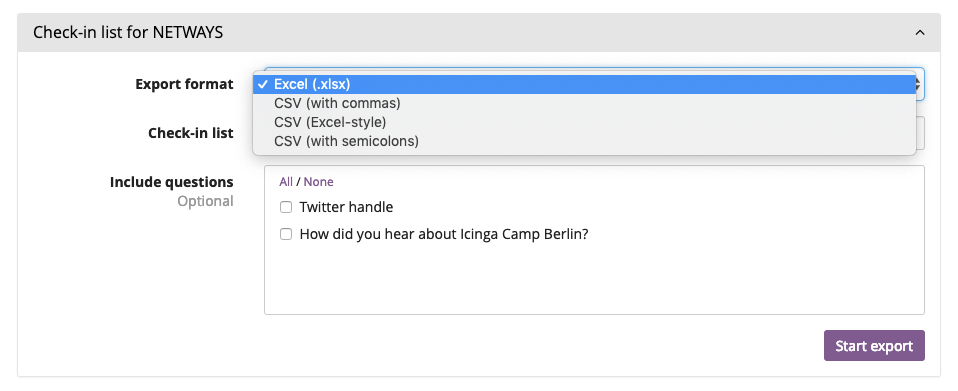
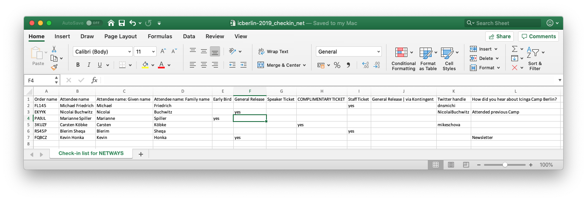

[](https://github.com/NETWAYS/pretix-checkinlist-net)

# Pretix Checkin List Export Plugin for NETWAYS

This plugin adds a custom checkin list export for NETWAYS hosted events and conferences
into Pretix.

 <a href="https://pretix.eu/about/en/"></a>

The default checkin list renders a row for each order, including the
attendee name. The main requirement for this plugin is to generate
the following data:

* One row per attendee
* Add sub events and orders as additional columns (e.g. optional hotel rooms, additional workshops, hackathons, etc.)
* Add answered questions/twitter handle



Supported output formats:

* Excel (.xlsx)
* CSV (with commas)
* CSV (Excel-style)
* CSV (with semicolons)



Attendee name parts are available with >= v2.0.0.

## Requirements

* Pretix >= 2.5.0
* Python >= 3.5.0 < 3.7.0

## Installation

The plugin is available on [Pypi](https://pypi.org/project/pretix-checkinlist-net/)
and can be installed using pip.

```
pip install pretix-checkinlist-net
```

## Configuration

Navigate into the admin control panel and choose your event.

`Settings > Plugins` and enable the plugin.

`Orders > Export > Check-in list for NETWAYS`.

## Documentation

This plugin was created by following the [Plugin API development docs](https://docs.pretix.eu/en/latest/development/api/plugins.html) and is inspired by [upstream](https://github.com/pretix/pretix/blob/master/src/pretix/plugins/checkinlists/exporters.py).

2.0.0+ uses the generic ListExporter class from upstream
to provide the same output formats as Pretix core.

## Development setup

Please follow the instructions in the [development docs](doc/50-development.md).

# Thanks

Raphael Michel for Pretix and the initial checkin list export code
which is adopted in this custom plugin.

# License

* Copyright 2018 NETWAYS GmbH <support@netways.de>
* Copyright 2018 Raphael Michel <mail@raphaelmichel.de>

Authors: Michael Friedrich, Raphael Michel

The code in this repository is published under the terms of the Apache License.
See the LICENSE file for the complete license text.
